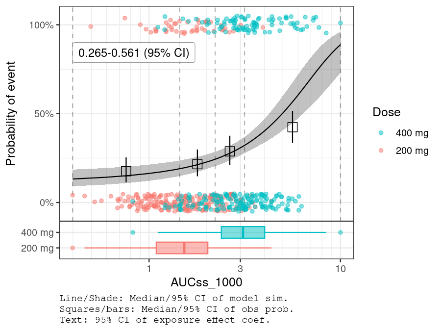
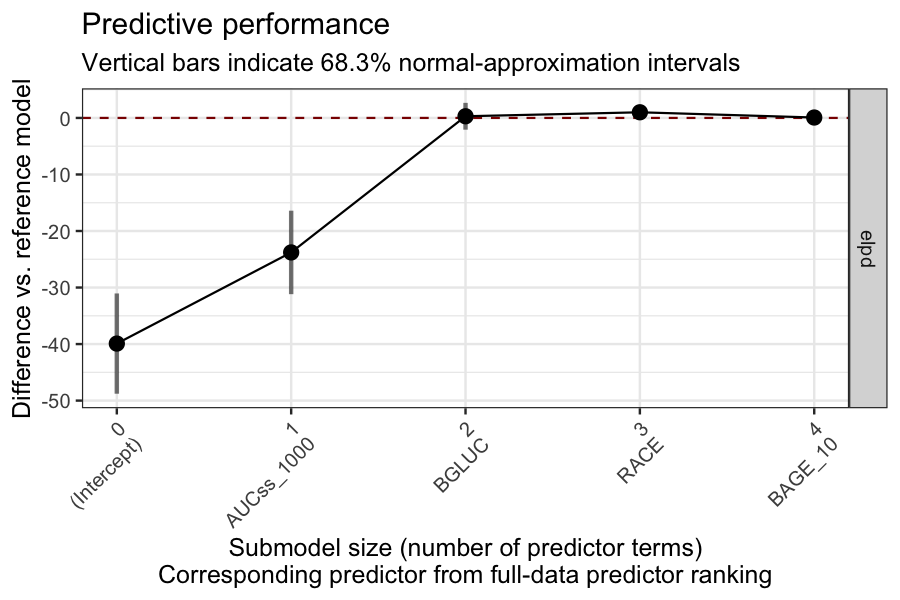
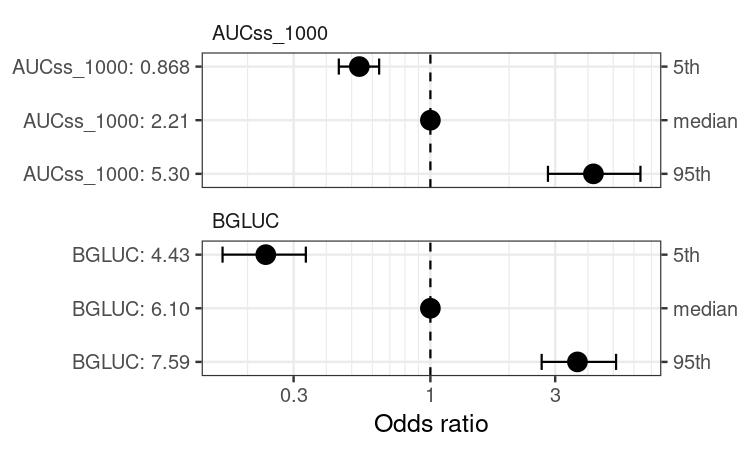

<!-- README.md is generated from README.Rmd. Please edit that file -->

# BayesERtools <a href="https://genentech.github.io/BayesERtools/"></a>

<!-- badges: start -->

[](https://github.com/Genentech/BayesERtools/actions/workflows/R-CMD-check.yaml)
<!-- badges: end -->

`BayesERtools` provides a suite of tools that facilitate
exposure-response analysis using Bayesian methods.

- Tutorial (`BayesERbook`): <https://genentech.github.io/BayesERbook/>
- Package documentation: <https://genentech.github.io/BayesERtools/>
- GitHub repo of the package:
  <https://github.com/genentech/BayesERtools/>

## Installation

You can install the `BayesERtools` with:

``` r
# install.packages('BayesERtools') # Once on CRAN
devtools::install_github("genentech/BayesERtools") # development version
```

You also need latest version of `rstanemax` (\>= 0.1.7) to use
E<sub>max</sub> model.

``` r
install.packages('rstanemax', repos = c(ppm = 'https://packagemanager.posit.co/cran/latest'))
```

## Supported model types

<div id="pzveloiefp" style="padding-left:0px;padding-right:0px;padding-top:10px;padding-bottom:10px;overflow-x:auto;overflow-y:auto;width:auto;height:auto;">
  &#10;  <table class="gt_table" data-quarto-disable-processing="false" data-quarto-bootstrap="false">
  <thead>
    <tr class="gt_col_headings gt_spanner_row">
      <th class="gt_col_heading gt_columns_bottom_border gt_left" rowspan="2" colspan="1" style="text-align: center; vertical-align: top;" scope="col" id="feature_name"></th>
      <th class="gt_center gt_columns_top_border gt_column_spanner_outer" rowspan="1" colspan="2" scope="colgroup" id="Binary endpoint">
        <div class="gt_column_spanner">Binary endpoint</div>
      </th>
      <th class="gt_center gt_columns_top_border gt_column_spanner_outer" rowspan="1" colspan="2" scope="colgroup" id="Continuous endpoint">
        <div class="gt_column_spanner">Continuous endpoint</div>
      </th>
    </tr>
    <tr class="gt_col_headings">
      <th class="gt_col_heading gt_columns_bottom_border gt_left" rowspan="1" colspan="1" style="text-align: center; vertical-align: top;" scope="col" id="lin_logit">Linear (logit)</th>
      <th class="gt_col_heading gt_columns_bottom_border gt_left" rowspan="1" colspan="1" style="text-align: center; vertical-align: top;" scope="col" id="emax_logit"><span class='gt_from_md'>E<sub/>max</sub> (logit)</span></th>
      <th class="gt_col_heading gt_columns_bottom_border gt_left" rowspan="1" colspan="1" style="text-align: center; vertical-align: top;" scope="col" id="linear">Linear</th>
      <th class="gt_col_heading gt_columns_bottom_border gt_left" rowspan="1" colspan="1" style="text-align: center; vertical-align: top;" scope="col" id="emax"><span class='gt_from_md'>E<sub/>max</sub></span></th>
    </tr>
  </thead>
  <tbody class="gt_table_body">
    <tr><td headers="feature_name" class="gt_row gt_left" style="text-align: right; vertical-align: middle;"><span class='gt_from_md'>backend</span></td>
<td headers="lin_logit" class="gt_row gt_left" style="text-align: center; vertical-align: middle;"><span class='gt_from_md'><code>rstanarm</code></span></td>
<td headers="emax_logit" class="gt_row gt_left" style="text-align: center; vertical-align: middle;"><span class='gt_from_md'><code>rstanemax</code></span></td>
<td headers="linear" class="gt_row gt_left" style="text-align: center; vertical-align: middle;"><span class='gt_from_md'><code>rstanarm</code></span></td>
<td headers="emax" class="gt_row gt_left" style="text-align: center; vertical-align: middle;"><span class='gt_from_md'><code>rstanemax</code></span></td></tr>
    <tr><td headers="feature_name" class="gt_row gt_left" style="text-align: right; vertical-align: middle;"><span class='gt_from_md'>reference</span></td>
<td headers="lin_logit" class="gt_row gt_left" style="text-align: center; vertical-align: middle;"><span style="white-space: pre;"><a href="https://mc-stan.org/rstanarm/reference/stan_glm.html" target="_blank" style="color:#008B8B;text-decoration:none;display: inline-block;">🔗</a></span></td>
<td headers="emax_logit" class="gt_row gt_left" style="text-align: center; vertical-align: middle;"><span style="white-space: pre;"><a href="https://yoshidk6.github.io/rstanemax/reference/stan_emax.html" target="_blank" style="color:#008B8B;text-decoration:none;display: inline-block;">🔗</a></span></td>
<td headers="linear" class="gt_row gt_left" style="text-align: center; vertical-align: middle;"><span style="white-space: pre;"><a href="https://mc-stan.org/rstanarm/reference/stan_glm.html" target="_blank" style="color:#008B8B;text-decoration:none;display: inline-block;">🔗</a></span></td>
<td headers="emax" class="gt_row gt_left" style="text-align: center; vertical-align: middle;"><span style="white-space: pre;"><a href="https://yoshidk6.github.io/rstanemax/reference/stan_emax_binary.html" target="_blank" style="color:#008B8B;text-decoration:none;display: inline-block;">🔗</a></span></td></tr>
    <tr><td headers="feature_name" class="gt_row gt_left" style="text-align: right; vertical-align: middle;"><span class='gt_from_md'>develop model</span></td>
<td headers="lin_logit" class="gt_row gt_left" style="text-align: center; vertical-align: middle;"><span class='gt_from_md'>✅</span></td>
<td headers="emax_logit" class="gt_row gt_left" style="text-align: center; vertical-align: middle;"><span class='gt_from_md'>✅</span></td>
<td headers="linear" class="gt_row gt_left" style="text-align: center; vertical-align: middle;"><span class='gt_from_md'>✅</span></td>
<td headers="emax" class="gt_row gt_left" style="text-align: center; vertical-align: middle;"><span class='gt_from_md'>✅</span></td></tr>
    <tr><td headers="feature_name" class="gt_row gt_left" style="text-align: right; vertical-align: middle;"><span class='gt_from_md'>simulate &amp; plot ER</span></td>
<td headers="lin_logit" class="gt_row gt_left" style="text-align: center; vertical-align: middle;"><span class='gt_from_md'>✅</span></td>
<td headers="emax_logit" class="gt_row gt_left" style="text-align: center; vertical-align: middle;"><span class='gt_from_md'>✅</span></td>
<td headers="linear" class="gt_row gt_left" style="text-align: center; vertical-align: middle;"><span class='gt_from_md'>✅</span></td>
<td headers="emax" class="gt_row gt_left" style="text-align: center; vertical-align: middle;"><span class='gt_from_md'>✅</span></td></tr>
    <tr><td headers="feature_name" class="gt_row gt_left" style="text-align: right; vertical-align: middle;"><span class='gt_from_md'>exposure metrics selection</span></td>
<td headers="lin_logit" class="gt_row gt_left" style="text-align: center; vertical-align: middle;"><span class='gt_from_md'>✅</span></td>
<td headers="emax_logit" class="gt_row gt_left" style="text-align: center; vertical-align: middle;"><span class='gt_from_md'>✅</span></td>
<td headers="linear" class="gt_row gt_left" style="text-align: center; vertical-align: middle;"><span class='gt_from_md'>✅</span></td>
<td headers="emax" class="gt_row gt_left" style="text-align: center; vertical-align: middle;"><span class='gt_from_md'>✅</span></td></tr>
    <tr><td headers="feature_name" class="gt_row gt_left" style="text-align: right; vertical-align: middle;"><span class='gt_from_md'>covariate selection</span></td>
<td headers="lin_logit" class="gt_row gt_left" style="text-align: center; vertical-align: middle;"><span class='gt_from_md'>✅</span></td>
<td headers="emax_logit" class="gt_row gt_left" style="text-align: center; vertical-align: middle;"><span class='gt_from_md'>❌</span></td>
<td headers="linear" class="gt_row gt_left" style="text-align: center; vertical-align: middle;"><span class='gt_from_md'>✅</span></td>
<td headers="emax" class="gt_row gt_left" style="text-align: center; vertical-align: middle;"><span class='gt_from_md'>❌</span></td></tr>
    <tr><td headers="feature_name" class="gt_row gt_left" style="text-align: right; vertical-align: middle;"><span class='gt_from_md'>covariate forest plot</span></td>
<td headers="lin_logit" class="gt_row gt_left" style="text-align: center; vertical-align: middle;"><span class='gt_from_md'>✅</span></td>
<td headers="emax_logit" class="gt_row gt_left" style="text-align: center; vertical-align: middle;"><span class='gt_from_md'>❌</span></td>
<td headers="linear" class="gt_row gt_left" style="text-align: center; vertical-align: middle;"><span class='gt_from_md'>🟡</span></td>
<td headers="emax" class="gt_row gt_left" style="text-align: center; vertical-align: middle;"><span class='gt_from_md'>❌</span></td></tr>
  </tbody>
  &#10;  <tfoot class="gt_footnotes">
    <tr>
      <td class="gt_footnote" colspan="5"> ✅ Available, 🟡 In plan/under development, ❌ Not in a current plan</td>
    </tr>
  </tfoot>
</table>
</div>

## Quick guide

Here is a quick demo on how to use this package for E-R analysis. See
`vignette("basic_workflow_bin")` for more thorough walk through of a
basic workflow.

``` r
# Load package and data
library(dplyr)
library(BayesERtools)
ggplot2::theme_set(ggplot2::theme_bw(base_size = 12))

data(d_sim_binom_cov)

# Hyperglycemia Grade 2+ (hgly2) data
df_er_ae_hgly2 <-
  d_sim_binom_cov |>
  filter(AETYPE == "hgly2") |>
  # Re-scale AUCss, baseline age
  mutate(
    AUCss_1000 = AUCss / 1000, BAGE_10 = BAGE / 10,
    Dose = paste(Dose_mg, "mg")
  )

var_resp <- "AEFLAG"
```

### Simple univariable model for binary endpoint

``` r
set.seed(1234)
ermod_bin <- dev_ermod_bin(
  data = df_er_ae_hgly2,
  var_resp = var_resp,
  var_exposure = "AUCss_1000"
)
ermod_bin
#> 
#> ── Binary ER model ─────────────────────────────────────────────────────────────
#> ℹ Use `plot_er()` to visualize ER curve
#> 
#> ── Developed model ──
#> 
#> stan_glm
#>  family:       binomial [logit]
#>  formula:      AEFLAG ~ AUCss_1000
#>  observations: 500
#>  predictors:   2
#> ------
#>             Median MAD_SD
#> (Intercept) -2.04   0.23 
#> AUCss_1000   0.41   0.08 
#> ------
#> * For help interpreting the printed output see ?print.stanreg
#> * For info on the priors used see ?prior_summary.stanreg

# Using `*` instead of `+` so that scale can be
# applied for both panels (main plot and boxplot)
plot_er_gof(ermod_bin, var_group = "Dose", show_coef_exp = TRUE) *
  xgxr::xgx_scale_x_log10()
```



### Covariate selection

BGLUC (baseline glucose) is selected while other two covariates are not.

``` r
set.seed(1234)
ermod_bin_cov_sel <-
  dev_ermod_bin_cov_sel(
    data = df_er_ae_hgly2,
    var_resp = var_resp,
    var_exposure = "AUCss_1000",
    var_cov_candidate = c("BAGE_10", "RACE", "BGLUC")
  )
#> 
#> ── Step 1: Full reference model fit ──
#> 
#> ── Step 2: Variable selection ──
#> 
#> ℹ The variables selected were: AUCss_1000, BGLUC
#> 
#> ── Step 3: Final model fit ──
#> 
#> ── Cov mod dev complete ──
#> 
ermod_bin_cov_sel
#> ── Binary ER model & covariate selection ───────────────────────────────────────
#> ℹ Use `plot_submod_performance()` to see variable selection performance
#> ℹ Use `plot_er()` with `marginal = TRUE` to visualize marginal ER curve
#> 
#> ── Selected model ──
#> 
#> stan_glm
#>  family:       binomial [logit]
#>  formula:      AEFLAG ~ AUCss_1000 + BGLUC
#>  observations: 500
#>  predictors:   3
#> ------
#>             Median MAD_SD
#> (Intercept) -7.59   0.90 
#> AUCss_1000   0.46   0.08 
#> BGLUC        0.87   0.13 
#> ------
#> * For help interpreting the printed output see ?print.stanreg
#> * For info on the priors used see ?prior_summary.stanreg
plot_submod_performance(ermod_bin_cov_sel)
```



``` r
coveffsim <- sim_coveff(ermod_bin_cov_sel)
plot_coveff(coveffsim)
```


