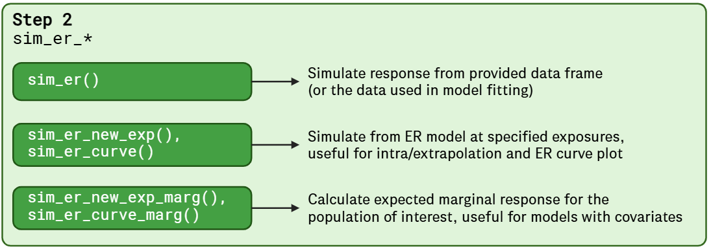
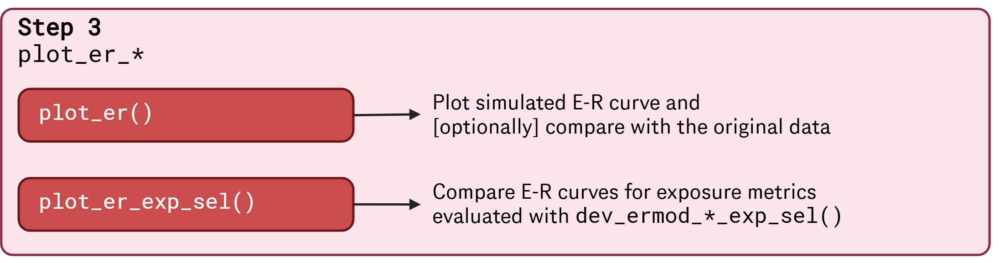

```{r, include = FALSE}
knitr::opts_chunk$set(
  collapse = TRUE,
  comment = "#>"
)
```

This vignette provides an overview of `BayesERtools`. 

## 0. Analysis workflow & supported model types

Analysis can be performed in the following simple steps.

{width=70%}
<br />

Supported model types are as follows:

```{r, echo = FALSE, warning=FALSE, message=FALSE}
library(gt)
library(dplyr)
set.seed(1234) # Needed to stablize div id

# Saved csv from README.Rmd
tab_mod <- read.csv("data/supported_models.csv")

tab_mod |>
  select(-.row_id) |>
  gt() |>
  fmt_markdown() |>
  fmt_url(
    columns = !1,
    rows = 2,
    label = "🔗",
    show_underline = FALSE
  ) |>
  tab_spanner(
    label = "Binary endpoint",
    columns = c(lin_logit, emax_logit)
  ) |>
  tab_spanner(
    label = "Continuous endpoint",
    columns = c(linear, emax)
  ) |>
  cols_label(
    feature_name = "",
    lin_logit = "Linear  \n(logit)",
    emax_logit = md("E<sub/>max</sub> (logit)"),
    linear = "Linear",
    emax = md("E<sub/>max</sub>"),
  ) |>
  tab_style(
    style = cell_text(v_align = "top", align = "center"),
    locations = cells_column_labels()
  ) |>
  tab_style(
    style = cell_text(v_align = "middle", align = "center"),
    locations = cells_body()
  ) |>
  tab_style(
    style = cell_text(v_align = "middle", align = "right"),
    locations = cells_body(columns = feature_name)
  ) |>
  tab_footnote(
    footnote = paste(
      "✅ Available",
      "🟡 In plan/under development",
      "❌ Not in a current plan",
      sep = ", "
    )
  )
```

## 1. ER model development

The package provides a set of functions to develop ER models. 
The following functions are available:

- Binary endpoint, linear logistic regression: `dev_ermod_bin()`, 
  `dev_ermod_bin_exp_sel()`, `dev_ermod_bin_cov_sel()`
- Continuous endpoint, Emax: `dev_ermod_emax()`

{width=100%}
<br />

## 2. Simulation from developed ER model

The following functions are available for simulation from developed ER models:

- `sim_er()`
- `sim_er_new_exp()`, `sim_er_curve()`
- `sim_er_new_exp_marg()`, `sim_er_curve_marg()`

{width=100%}
<br />

## 3. Plot simulated ER curve

Simulated ER curve can be visualized with the following functions:

- `plot_er()`
- `plot_er_exp_sel()`

{width=100%}
<br />

## Acknowledgement

Figure created in https://www.biorender.com


